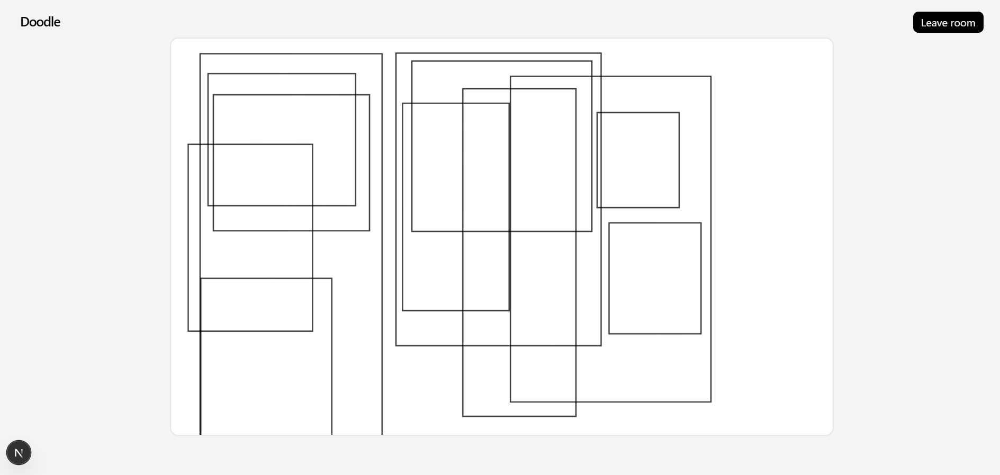

# Doodle



## First Draft (v0)

- Auth implemented
- WebSocket support enabled
- Rectangle drawing supported only (for now)

---

## Building Steps

- Created server, tsconfig extends, package.json (workspace:\*)
- turbo.json (./dist/\*\*)
- use pnpm for installations and running
- added zod-types in packages (changed package.json and tsconfig)
- new packages should export
- Whenever you use packages (in package.json => workspace:\*)

- Prisma

```
pnpm add prisma @prisma/client @prisma/pg-adapter dotenv
npx prisma init
npx prisma generate
npx prisma migrate dev --name init
npx prisma generate [after migrations]
npx prisma studio   [visualizer]
```

- Completed the basic backends

- Prisma setup worked

```
pnpm --filter @repo/db build
```

- Wrote backend logic

- Completed mvp websocket logic

- Things to fix
  - Route protection
